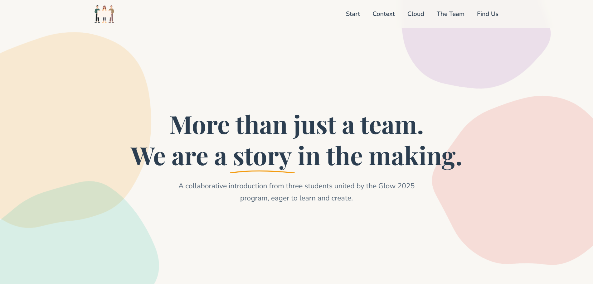

# Our Team's Story | Glow 2025 Cloud Computing Project 🚀


An introductory landing page created by three students from Indonesia and Malaysia as part of the **Glow 2025** international collaboration program. This project not only introduces our team but also shares foundational knowledge about **Cloud Computing** that we learned.

<br>

## 🖼️ Project Preview



<br>

## ✨ Key Features

-   ✅ **Fully Responsive Design**: Optimal viewing experience across various devices, from desktops to mobile phones.
-   ✅ **Interactive & Modern UI**: Features smooth animations, hover effects, and decorative floating blobs for a dynamic user experience.
-   ✅ **Educational Content**: Easy-to-understand explanations of basic Cloud Computing concepts (IaaS, PaaS, SaaS) and their benefits.
-   ✅ **Dynamic Team Introduction**: Elegant presentation of each team member's profile.
-   ✅ **Quick Navigation**: A sticky navbar and a scroll-to-top button for easy navigation.

<br>

## 🛠️ Tech Stack Used

This project was built with fundamental web technologies, with a focus on modern practices.

-   **Structure & Content**: `HTML5` (with semantic structure)
-   **Styling & Design**:
    -   `CSS3`
    -   **CSS Custom Properties** (Variables) for easy theme management.
    -   **Flexbox** & **Grid** for complex and responsive layouts.
    -   **Animations** & **Transitions** for visual effects.
-   **Functionality & Interactivity**:
    -   `JavaScript (ES6+)`
    -   **DOM Manipulation** for the hamburger menu and other interactive elements.
    -   **Intersection Observer API** for fade-in effects on scroll.
-   **Fonts & Icons**:
    -   [Font Awesome](https://fontawesome.com/) for icons.
    -   [Google Fonts](https://fonts.google.com/) (Playfair Display & Nunito Sans) for elegant typography.

<br>

## 👥 Our Team

This project is a collaboration of three talented students:

| Photo                           | Name                       | University                     | GitHub                                           |
| :------------------------------ | :------------------------- | :------------------------------ | :------------------------------------------------ |
|  | **Hilmy Baihaqi** | Telkom University, Indonesia    | [hilmybaihaqii](https://github.com/hilmybaihaqii) |
|  | **Citra Kusumadewi S.** | Telkom University, Indonesia    | [citraakusumadewi](https://github.com/citraakusumadewi) |
|  | **Es Shahdiya Bin Es Z.** | i-CATS University College, Malaysia | ([Reign2308](https://github.com/Reign2308) |

<br>

## 🎓 Guidance

This project would not have been possible without the guidance and knowledge from our esteemed lecturers in the Glow 2025 program.

-   **Ts. Puan Rajina Binti M A Raj Mohamed** - *International Speaker* (Universiti Tenaga Nasional, Malaysia)
-   **Suryo Adhiwibowo, S.T., M.T., Ph.D.** - *Co-Lecturer* (Telkom University, Indonesia)

<br>

## 🚀 How to Run This Project Locally

Want to see this code in action on your computer? Follow these steps:

1.  **Clone this repository:**
    ```bash
    git clone [https://github.com/your-username/your-repository-name.git](https://github.com/your-username/your-repository-name.git)
    ```
2.  **Navigate to the project directory:**
    ```bash
    cd your-repository-name
    ```
3.  **Open the `index.html` file** in your favorite browser.

---
*© 2025 | Made with ❤️ by Hilmy, Citra & Es for the Glow 2025 Program.*
